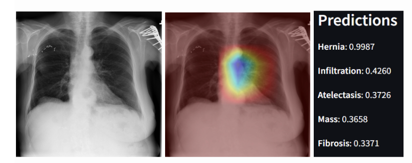
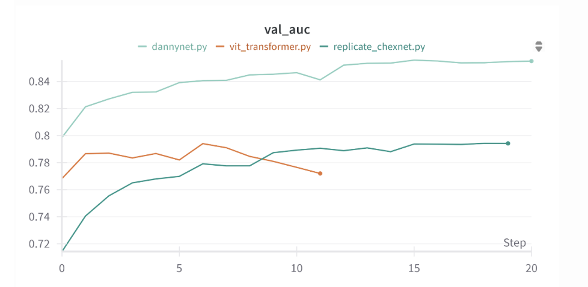
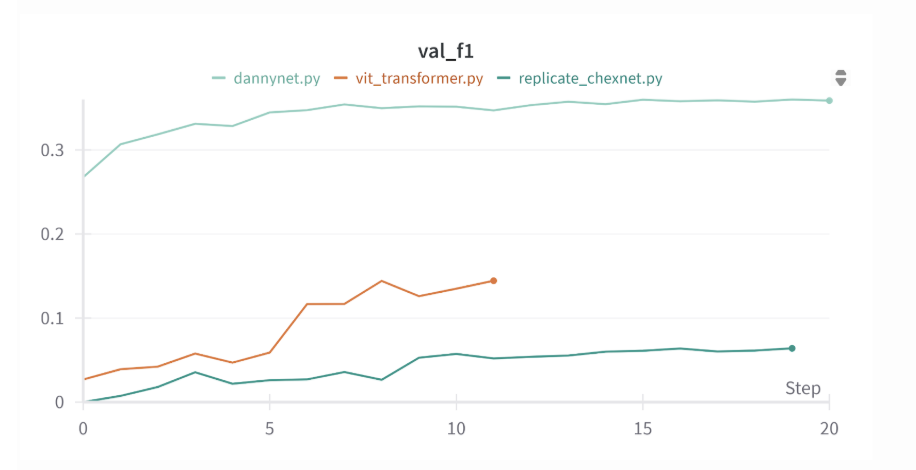
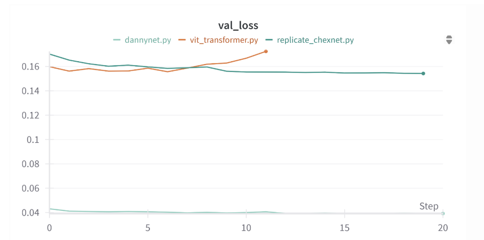

# Summary
This project aimed to rigorously reproduce and extend CheXNet, a landmark deep learning
model in medical imaging. Through our efforts, we demonstrated that meaningful improvements
to the original architecture can be achieved by incorporating techniques developed
since the paper’s publication. Specifically, we found that the use of Focal Loss, the AdamW
optimizer with weight decay, Color Jitter for data augmentation, ReduceLROnPlateau
scheduling, and per-disease F1 threshold tuning substantially improved model stability and
performance across all 14 thoracic disease classes. Our model, "DacNet," achieved a
strong balance between interpretability and predictive power, reaching an average AUC of
0.85 and an F1 score of 0.39. These results highlight the potential for targeted enhancements
to significantly improve performance on imbalanced and clinically relevant datasets like NIH
ChestX-ray14. Beyond the technical contributions, this project underscores the importance
of reproducibility in machine learning research. We were motivated not only to validate the
claims of a high-impact study, but also to contribute openly to the scientific community.
Our full codebase, including model configurations, evaluation tools, and visualization scripts,
has been made publicly available in hopes of promoting transparency and enabling further
development by others. Ultimately, this work contributes to both the biomedical and data science communities by showing how modern training strategies can elevate model
performance in critical clinical applications. We hope our findings serve as a foundation for
future work exploring deep learning in medical diagnostics and for building more accurate,
interpretable, and equitable AI tools in healthcare.

# Statement of need
Chest X-ray classification is a crucial task in medical image analysis, where deep learning
models are trained to detect various thoracic diseases from radiographic scans. A landmark
study in this field, known as CheXNet, introduced a 121-layer DenseNet convolutional neural
network that reportedly outperformed radiologists in detecting pneumonia [@rajpurkar2017chexnet]. Their work
used the NIH ChestX-ray14 dataset, a publicly available dataset of over 100,000 frontal-view
chest X-rays labeled with up to 14 disease classes [@nih2017chestxray]. The success of CheXNet has inspired
further research, as it represents a significant step toward using artificial intelligence to assist
in clinical diagnosis, especially in regions where access to licensed radiologists is limited [@hwang2023tuberculosis].
In the midst of a reproducibility crisis in academia, independent researchers must reproduce
groundbreaking studies like this in order to help guide future research [@vannoorden2015reproducibility]. In this project, we
set out to replicate the original CheXNet model as closely as possible, evaluate and improve
performance metrics such as AUC-ROC and F1 scores across all 14 disease classes, and
explore whether newer deep learning techniques, particularly Vision Transformers (ViTs),
could offer performance improvements over traditional convolutional neural networks. All
code for our models and evaluation pipeline is publicly available in our [GitHub repository](https://github.com/dstrick17/DacNet) under an open-source MIT License. 

While our primary goal was to replicate the original CheXNet study, we also recognize the importance of its successor,
CheXNeXt, which validated a similar model against board-certified radiologists on a curated
internal dataset [@rajpurkar2018chexnext]. Although the test set used in CheXNeXt is not publicly available,
its findings emphasize the clinical relevance of these models and reinforce the need for
reproducible benchmarking in public datasets like NIH ChestX-ray14.
Our key contributions are as follows: We performed a faithful replication of the CheXNet
model, establishing a reproducible baseline using pretrained DenseNet-121 with standard
training procedures. We proposed an improved model, DacNet, which incorporates Focal Loss, the AdamWoptimizer, and advanced image augmentations like Color Jitter. It achieved
significantly higher F1 scores on rare classes compared to the baseline. We implemented
per-class F1 threshold optimization to further boost classification accuracy, especially in
multi-label settings. Unlike the original CheXNet study, which only reported an F1 score for
pneumonia using a non-public expert-labeled subset, our study computes per-class F1 scores
across all 14 diseases using a reproducible patient-wise split. This provides a more granular
view of model strengths and limitations in multi-label medical image classification. We
explored the use of transformer-based models (ViT) for X-ray classification, benchmarking
their performance against CNN-based architectures. Finally, we developed a Streamlit web
app hosted on Hugging Face that takes a chest X-ray input, returns disease predictions
using DacNet, and overlays Grad-CAM heatmaps to visualize model attention.

# Methods
We built on DenseNet-121 but replaced the
BCE loss with Focal Loss (gamma=2, alpha=1) to address extreme class imbalance.
We used the AdamW optimizer with weight decay, a learning rate of 0.00005, and a
ReduceLROnPlateau scheduler. Augmentations included RandomResizedCrop(224),
RandomHorizontalFlip, and ColorJitter. This model was trained using a patient-level
split and achieved a test AUC of 0.85, a test loss of 0.04, and an average F1 score of 0.39.
We believe the focal loss contributed significantly to reducing test loss and improving
prediction confidence on minority classes. This model outperformed CheXNet in AUC
for 9 out of 14 diseases.

# Figures

---
**Performance vs older models and publications on Test AUC scores per disease**
| Pathology           | original CheXNet | Dacnet.py | vit_transformer.py | replicate_chexnet.py |
|---------------------|------------------|----------|-------------------|--------------------|
| Atelectasis         | 0.8094           | **0.817** | 0.774           | 0.762              |
| Cardiomegaly        | 0.9248           | **0.932** | 0.89            | 0.922              |
| Consolidation       | **0.7901**       | 0.783     | 0.789           | 0.746              |
| Edema               | 0.8878           | **0.896** | 0.876           | 0.864              |
| Effusion            | 0.8638           | **0.905** | 0.857           | 0.883              |
| Emphysema           | 0.9371           | **0.963** | 0.828           | 0.85               |
| Fibrosis            | 0.8047           | **0.814** | 0.772           | 0.766              |
| Hernia              | 0.9164           | **0.997** | 0.872           | 0.925              |
| Infiltration        | **0.7345**       | 0.708     | 0.7             | 0.673              |
| Mass                | 0.8676           | **0.919** | 0.783           | 0.824              |
| Nodule              | 0.7802           | **0.789** | 0.673           | 0.646              |
| Pleural Thickening  | **0.8062**       | 0.801     | 0.766           | 0.756              |
| Pneumonia           | **0.768**        | 0.74      | 0.713           | 0.656              |
| Pneumothorax        | **0.8887**       | 0.875     | 0.821           | 0.827              |

---
### Average metrics across all diseases for each model
| Metric  | DacNet | ViT Transformer | Replicate CheXNet |
|---------|----------|------------------|--------------------|
| Loss    | **0.0416** | 0.1589           | 0.1661             |
| AUC     | **0.8527** | 0.7940           | 0.7928             |
| F1      | **0.3861** | 0.1114           | 0.0763             |
---
### F1 Score Comparison for Each Model

| Disease             | DacNet | ViT Transformer  | Replicate CheXNet |
|---------------------|----------|------------------|--------------------|
| **AVERAGE**         | **0.386** | 0.111           | 0.076              |
| Atelectasis         | **0.421** | 0.127           | 0.026              |
| Cardiomegaly        | **0.532** | 0.264           | 0.423              |
| Consolidation       | **0.226** | 0               | 0                  |
| Edema               | **0.286** | 0.004           | 0                  |
| Effusion            | **0.623** | 0.427           | 0.459              |
| Emphysema           | **0.516** | 0.079           | 0                  |
| Fibrosis            | **0.127** | 0               | 0                  |
| Hernia              | **0.750** | 0               | 0                  |
| Infiltration        | **0.395** | 0.193           | 0.061              |
| Mass                | **0.477** | 0.213           | 0.079              |
| Nodule              | **0.352** | 0.041           | 0                  |
| Pleural Thickening  | **0.258** | 0               | 0                  |
| Pneumonia           | **0.082** | 0               | 0                  |
| Pneumothorax        | **0.360** | 0.211           | 0.021              |

# Figures

---
# Acknowledgements
We would like to thank Thomas Gardos, PhD for his mentorship and support.

